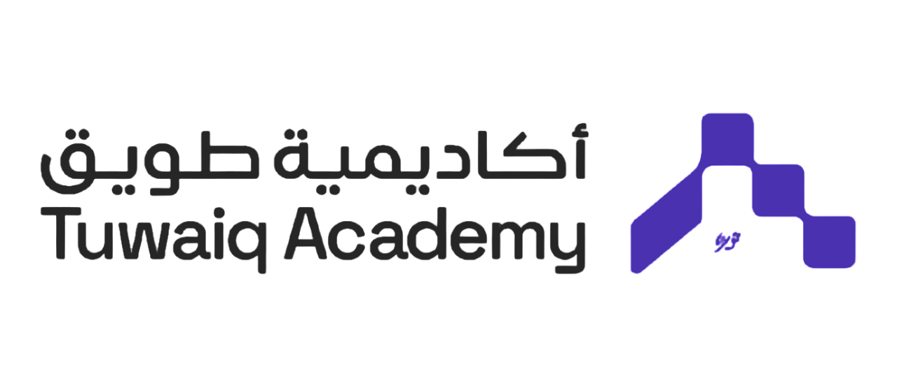

<!--
*** Thanks for checking out this README Template. If you have a suggestion that would
*** make this better, please fork the repo and create a pull request or simply open
*** an issue with the tag "enhancement".
*** Thanks again! Now go create something AMAZING! :D
-->

<!-- PROJECT SHIELDS -->
<!--
*** I'm using markdown "reference style" links for readability.
*** Reference links are enclosed in brackets [ ] instead of parentheses ( ).
*** See the bottom of this document for the declaration of the reference variables
*** for contributors-url, forks-url, etc. This is an optional, concise syntax you may use.
*** https://www.markdownguide.org/basic-syntax/#reference-style-links
-->
[![Contributors][contributors-shield]][contributors-url]
[![Forks][forks-shield]][forks-url]
[![Stargazers][stars-shield]][stars-url]
[![Issues][issues-shield]][issues-url]

<!-- PROJECT LOGO -->
<br />
<p align="center">
  <a href="">

  </a>

<h3 align="center">Car Pooling System</h3>

  <p align="center">
    This project is requirement of the Web application development using Java Spring Boot bootcamps in Tuwaiq Academy!
    <br />
    <a href="https://github.com/salemALmotiry/Java-Bootcamp-Day-17-Project2"><strong>Explore the docs »</strong></a>
    <br />
    <br />
    <a href="https://replit.com/@salmotiry/Java-Bootcamp-Day-17-Project2">View Demo</a>
    ·
    <a href="https://github.com/salemALmotiry/Java-Bootcamp-Day-17-Project2/issues">Report Bug</a>
    ·
    <a href="https://github.com/salemALmotiry/Java-Bootcamp-Day-17-Project2/issues">Request Feature</a>
  </p>


<!-- TABLE OF CONTENTS -->
## Table of Contents

* [About the Project](#about-the-project)
    * [Built With](#built-with)
    * [Live Version](#live-version)
    * [Usage](#usage)
* [Contributing](#Contributing)
* [Acknowledgements](#acknowledgements)
* [License](#license)

<!-- ABOUT THE PROJECT -->
## About The Project
This is the Java Car Pooling System Project. In this application, users can manage car schedules and bookings, 
allowing for a streamlined carpooling experience among multiple passengers.
The system manages a variety of entities, including Cars, Routes, and Passengers.
<br/><br /><br />
[![Product Name Screen Shot][product-screenshot]](https://replit.com/@salmotiry/Java-Bootcamp-Day-17-Project2)


### Built With
This project was built using these technologies.
* JAVA
* IntelliJ IDEA


<!-- ABOUT THE PROJECT -->
## Usage

To run this project you need to:
* have Java installed in your computer
* [download](https://github.com/SalemAlmotiry/Java-Bootcamp-Day-17-Project2/archive/master.zip) or clone this repo:
    - Clone with SSH:
  ```
    git@github.com:SalemALmotiry/Java-Bootcamp-Day-17-Project2
  ```
    - Clone with HTTPS
  ```
    https://github.com/SalemALmotiry/Java-Bootcamp-Day-17-Project2.git
  ```
* and execute src/main.java file using your terminal

<!-- LIVE VERSION -->
## Live version

You can see it working [here](https://replit.com/@salmotiry/Java-Bootcamp-Day-17-Project2)


<!-- Contributing -->

## Contributing

Contributions, issues and feature requests are welcome!

Feel free to check the [issues page](https://github.com/salemALmotiry/Java-Bootcamp-Day-17-Project2/issues).

## Show your support

Give a :star: if you like this project!


<!-- ACKNOWLEDGEMENTS -->
## Acknowledgements
* [Java](https://www.java.com/en/)
* [IntelliJ IDEA](https://www.jetbrains.com/idea)
* [Replit](https://replit.com/)

<!-- MARKDOWN LINKS & IMAGES -->
<!-- https://www.markdownguide.org/basic-syntax/#reference-style-links -->
[contributors-shield]: https://img.shields.io/github/contributors/salemALmotiry/Java-Bootcamp-Day-17-Project2.svg?style=flat-square
[contributors-url]:https://github.com/salemALmotiry/Java-Bootcamp-Day-17-Project2/graphs/contributors
[forks-shield]: https://img.shields.io/github/forks/salemALmotiry/Java-Bootcamp-Day-17-Project2.svg?style=flat-square
[forks-url]: https://github.com/salemALmotiry/Java-Bootcamp-Day-17-Project2/network/members
[stars-shield]: https://img.shields.io/github/stars/salemALmotiry/Java-Bootcamp-Day-17-Project2.svg?style=flat-square
[stars-url]: https://github.com/salemALmotiry/Java-Bootcamp-Day-17-Project2/stargazers
[issues-shield]: https://img.shields.io/github/issues/salemALmotiry/Java-Bootcamp-Day-17-Project2.svg?style=flat-square
[issues-url]: https://github.com/salemALmotiry/Java-Bootcamp-Day-17-Project2/graphs/contributors
[product-screenshot]: images/CarPoolingSystem.png

<!-- License -->

## 📝 License

This project is [MIT](https://opensource.org/licenses/MIT) licensed.
